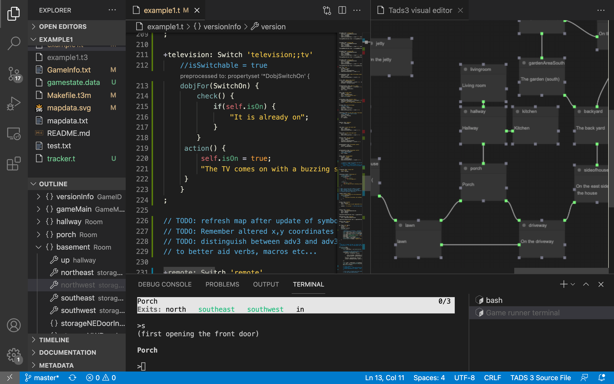

# vscode-tads3tools

A language server/client for the Tads3 programming language and tailored made for Visual Studio Code by Microsoft. 

# version 0.5 - alpha
[](./screenshots/vscode-tads3tools.png)

## Functionality

It has the following features:

- Diagnostics regenerated on each file change 
- Symbol outliner derived from each file in the tads3 project
- Symbol definitions (with cross references through the project files)
- CodeLens for showing preprocessed differences 
- A webview containing the visual map for visualizing and helping out creating a game world.
- Word completions (fuzzy searching through defined symbols and keywords in the project)
- Auto generate decorations based on room descriptions
- Auto monitoring the tads3 game image and restart the game on any changes
- Snippets to help out with commonly used classes, such as Room, Thing, Actor, ActorState, AgendaItem, Topic etc...
- Various commands and more...

## Structure

```
.
├── client // Language Client
│   ├── src
│   │   ├── test // End to End tests for Language Client / Server
│   │   └── extension.ts // Language Client entry point
├── package.json // The extension manifest.
└── server // Language Server
    └── src
        └── server.ts // Language Server
```


## Attribution
 - Microsoft - This language server is based on the example found in (https://github.com/microsoft/vscode-extension-samples/tree/main/lsp-sample)  MIT License

 - Antlr4 was used to generate a parser for the Tads3 programming Language (https://github.com/antlr/antlr4) BSD 3-clause license 
 - Antlr4ts was used to produce a specific typescript target of the antlr4 grammar (https://github.com/tunnelvisionlabs/antlr4ts) BSD 
 - Litegraph (https://github.com/jagenjo/litegraph.js) MIT License
 - RxJS (https://github.com/ReactiveX/rxjs) Apache-2.0 License 
 - Fuzzysort (https://github.com/farzher/fuzzysort) MIT License
 - Wink pos-tagger (https://github.com/winkjs/wink-pos-tagger) MIT License
 - Threads (https://github.com/andywer/threads.js) by Andy Wermke(andywer) MIT License
 - The Tads3 tmLanguage definition (for syntax highlighting) is copied from Sam Win-Mason
   (repo here: https://github.com/Or4c/vscode-tads3), and originally ported from the Sublime Text plugin by VoidPhantom (https://github.com/VoidPhantom/sublime-tads3) (Both distributed under the UNLICENSE license 


## Disclaimer
This is a work in progress and is considered at the moment an early alpha. It has probably a ton of bugs left to fix. Use at your own risk. 

## License

The vscode-tads3tools is licensed under the MIT License

@Copyright Tomas Öberg 2021