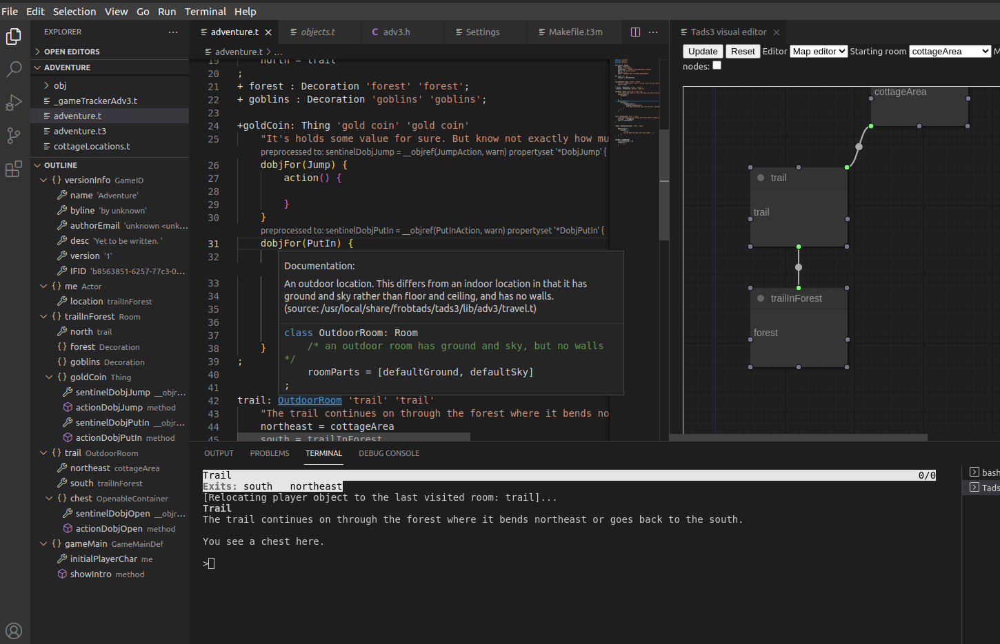

# vscode-tads3tools

A language server/client for TADS 3 and TADS 2, tailored for Visual Studio Code. Prioritized for **Linux** and **Mac**, with **Windows** support.

## Installation

Install via the VS Code marketplace — search for "tads3tools" in the Extensions tab.

Windows-specific instructions are [here](docs/installing-vscode-tads3-tools-on-windows.md).

## Development

This repository uses npm as the package manager.

- Use `npm` for install, build, test, and publish workflows.
- Do not add or update Yarn lockfiles for this project.

## Getting started

Open a TADS 3 project folder in VS Code, or create one via the command palette (`Ctrl+Shift+P`): **"Tads3 command: Create a new Tads3 template project"**.

The extension relies on the project's `.t3m` Makefile to locate includes and libraries. If `t3make` compiles the project from the command line, the extension should work out of the box.

### TADS 2

Requires `t3make`, the TADS 2 compiler (`tadsc` / `tc32.exe`), and the library path. Configure via:

- `tads.preprocessor.path` (default: `t3make`)
- `tads2.compiler.path` (default: `tadsc`)
- `tads2.library.path` (default: `/usr/local/share/frobtads/tads2/`)

A full list of all available commands is in the **[Command Reference](docs/commands.md)**.

## Features

**Symbol outline**

<https://user-images.githubusercontent.com/39532593/130358201-3be0d686-465c-4316-b304-9e7370f93347.mp4>

**Go to definition**

<https://user-images.githubusercontent.com/39532593/130358231-eb120e91-8521-498e-bd3b-a3cc3c7318ae.mp4>

**Hover documentation**

<https://user-images.githubusercontent.com/39532593/132140782-1de7cd37-6c10-400c-92e0-722a02d75e01.mp4>

**Create new project**

<https://user-images.githubusercontent.com/39532593/130358170-ea5878d5-c504-4b55-94e8-10ae55a6fa84.mp4>

---

**Visual map editor** — `"Tads3 command: Open current tads3 source code in Tads3 Visual Editor"`

Displays a live map of the game world with interactive exits and room editing.

<https://user-images.githubusercontent.com/39532593/130358350-a4c9c3a4-4b73-4fcd-9e76-ad39a44cee8e.mp4>

---

**Diagnostics on save**

<https://user-images.githubusercontent.com/39532593/130358270-b5d887e2-bcc1-430e-8806-9a42a79119c5.mp4>

**Code completions**

<https://user-images.githubusercontent.com/39532593/130358322-24908cf1-9b69-49b5-836c-bbeb03735894.mp4>

**Completion documentation**

<https://user-images.githubusercontent.com/39532593/132140758-9c4c9d69-8d6c-4e65-b18d-eac583b32ba8.mp4>

**Snippets**

<https://user-images.githubusercontent.com/39532593/130358339-227d99c6-6325-4de4-9e06-03cd54392430.mp4>

<https://user-images.githubusercontent.com/39532593/130358342-109e2ea7-619c-47b3-aa47-1f920bb19bf4.mp4>

---

**Code actions** — `"Tads3 command: Analyze the text at the current position and offer code actions"`

Uses NLP to identify nouns in a room description and offers to create decoration objects for them, with automatic `+`/`++` levelling.

<https://user-images.githubusercontent.com/39532593/130358397-e1c7bf6a-217f-44bb-9388-b18e6c20ed3a.mp4>

---

**Preprocessor view** — inspect preprocessed source for debugging

<https://user-images.githubusercontent.com/39532593/130358400-d8c96975-27da-4e70-974d-b65b4ad34717.mp4>

---

**String extraction** — extract all quoted strings in the project or current file

<https://user-images.githubusercontent.com/39532593/130358391-4115016f-2e3b-4bd4-ada4-6f2f2892aae2.mp4>

---

**Auto-restart interpreter** — `"Tads3 command: Toggles on/off if the game should restarted as soon as the t3 image game file changes"`

Relaunches the game in a terminal on every successful compile. Configurable interpreter via `tads3.gameRunnerInterpreter` (default: `frob`).

**Game position tracker** — `"Tads3 command: Install a tracker game file..."`

Persists the player's room position between sessions, enabling a continuous inner development loop together with the auto-restart feature.

**Download extensions** — `"Tads3 command: Download and install extension(s)"`

Fetches TADS 3 extensions from the IF Archive and installs them into the project folder.

---

## Attributions

- [Microsoft LSP sample](https://github.com/microsoft/vscode-extension-samples/tree/main/lsp-sample) — MIT
- [ANTLR4](https://github.com/antlr/antlr4) — BSD 3-Clause
- [antlr4ts](https://github.com/tunnelvisionlabs/antlr4ts) — BSD
- [LiteGraph](https://github.com/jagenjo/litegraph.js) — MIT
- [RxJS](https://github.com/ReactiveX/rxjs) — Apache-2.0
- [fuzzysort](https://github.com/farzher/fuzzysort) — MIT
- [wink-pos-tagger](https://github.com/winkjs/wink-pos-tagger) — MIT
- [threads.js](https://github.com/andywer/threads.js) — MIT
- [Axios](https://github.com/axios/axios) — MIT
- TADS 3 tmLanguage by Sam Win-Mason, ported from Sublime Text plugin by VoidPhantom — UNLICENSE

## License

MIT — Copyright Tomas Öberg 2021
